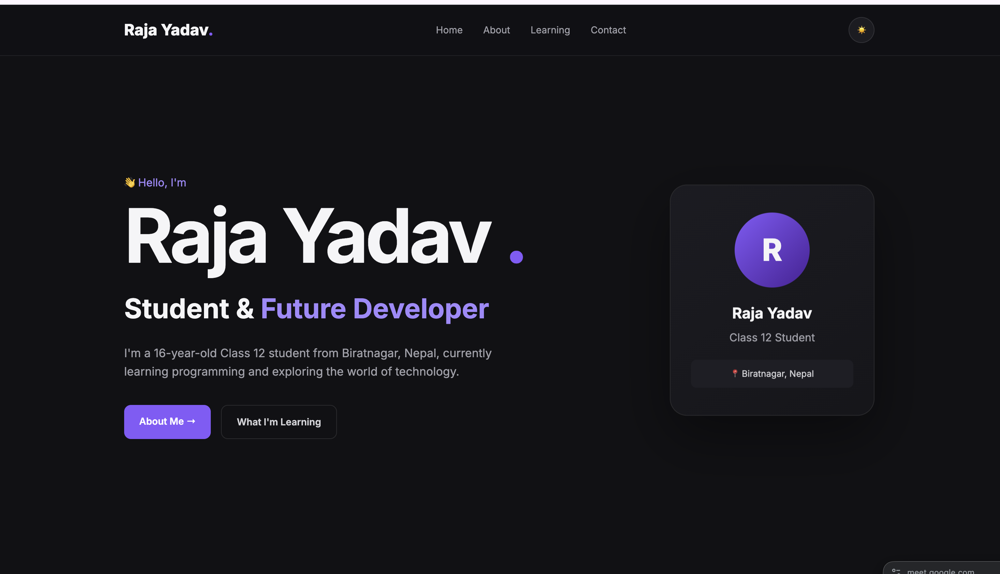
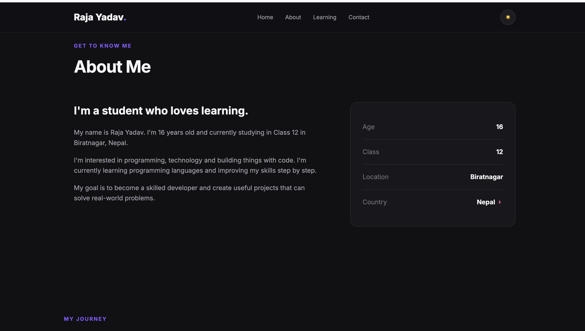

# Raja Yadav — Portfolio

A personal website built by ** me raja yadav** to showcase my projects,skills,journey,and work as a young developer.

## Description

This is my personal portfolio website , designed and handcoded by me from scratch, It is a place where I can showcase who I am, what i have build, and what I am currently learning as a new bie.

The portfolio is built using React.js, bun.js, and CSS I chose bun after researching javascript runtimes and being interested in its speed and easiness

There is currently no backend, because  im focusing on learning react.js and improving my frontend development skills.

The project is still work in progress, and I plan to continue this , expanding it with m ore projects, features, animations, and improvements as I learn.

> Built with curiosity, and a lot of ❤️ by raja yadav**.

## Screenshots

Add at least one screenshot of the portfolio here.

Example:




## Getting Started

### Dependencies

Before running the project, make sure you have:

* node.js or **Bun.js**
* A modern web browser such as Chrome, Safari.
* **Git ** (optional, if cloning the repository)

The project is primarily built and run using **Bun.javascript here**.

### Installing

Clone the repo here:

```bash
git clone [me](https://github.com/rajayadav/portfolio)
```

Move into the project folder:

```bash
cd client
```

Install the dependencies:

```bash
bun install
```

### Executing program

Start the development server:

```bash
bun run dev
```

Then open the local URL shown in your terminal, usually->

```text
http://localhost:3000
```

The exact port may be different depending on your project configuration.

## Help

If the project does not start, try reinstalling the dependencies:

```bash
rm -rf node_modules
bun install
bun run dev
```

If Bun is not installed, install it from the official Bun website.

Make sure you are running the commands from the project directory.

## License

This project is currently a personal portfolio project. No specific open-source license has been added yet.
